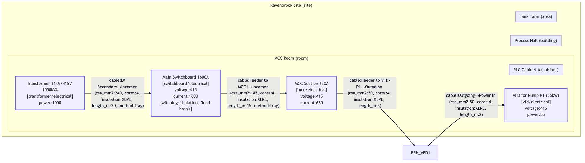
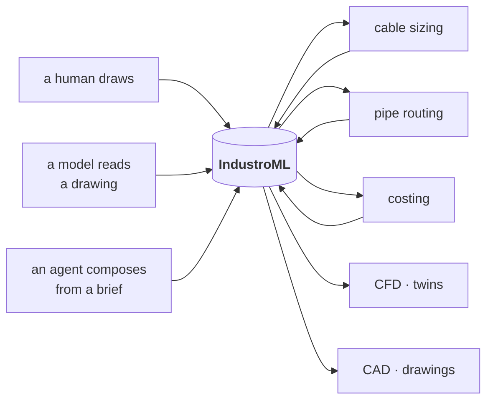
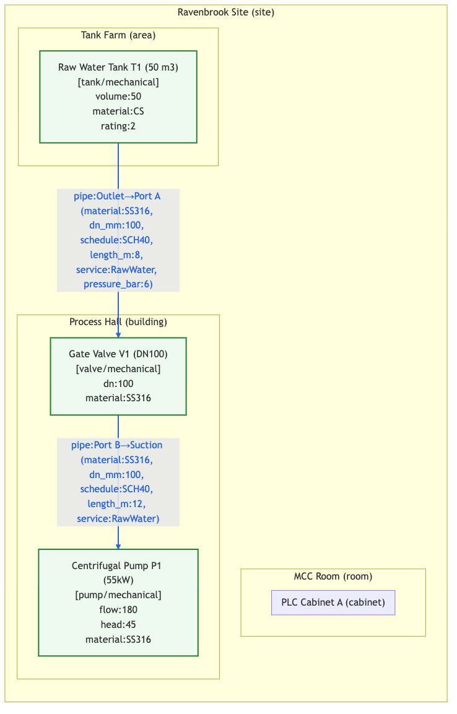
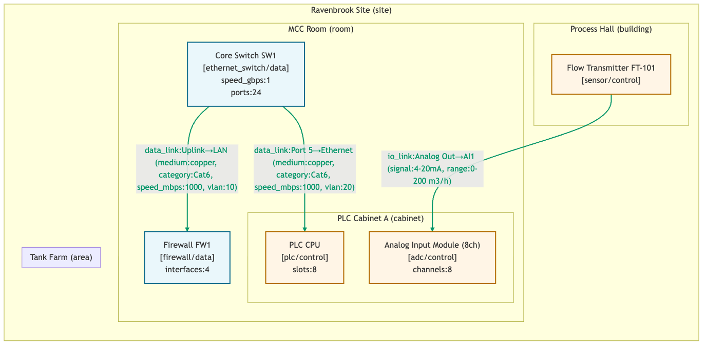

# IndustroML

**One schema for a plant, across every engineering domain that has to agree
about it.**

<p align="center">
  
</p>
<p align="center"><sub>One model, filtered to the electrical domain and rendered. The same file also produces the P&amp;ID, the network diagram and the control loops.</sub></p>

An electrical engineer, a mechanical engineer, a controls engineer and a network
engineer describe the same building four times, in four tools, and reconcile
them in meetings. IndustroML is a markup language that lets them describe it
once — containers, assets, interfaces and connections — so that a pump is one
object with a power feed, a pipe, an I/O point and a network address rather than
four unrelated drawings of a pump.

It is a **text format**, which is the whole point: it diffs, it reviews, it
validates in CI, and an agent can write it.

---

## Where this sits

IndustroML is the interchange format for
**[SD-DC](https://github.com/sinkers/sd-dc)**, an agentic stack for data centre
design. There, the model is the thing that cable sizing, pipe routing, costing,
CFD and containerised CAD agents all read and write, so that no tool has to
invent a format to talk to the next one.



Nothing about the format is data-centre specific. The worked examples here are a
water treatment plant and a wastewater plant, because those exercise all five
domains harder than a data hall does.

---

## The object model

Four lists, and that is the entire format.

| | What it is | Examples |
|---|---|---|
| **containers** | Physical or logical groupings. They nest. | site, building, room, area, skid, cabinet, rack, tray, pipe_rack, conduit |
| **assets** | The equipment. Each belongs to one container. | transformer, switchboard, pump, heat_exchanger, PLC, firewall, gas_detector |
| **interfaces** | The ports on an asset. Each has a domain and a medium. | `P1.SUC`, `MSB1.FEED-MCC1`, `PLC1.AI1` |
| **connections** | What joins two interfaces, and how it gets there. | cable, pipe, data_link, io_link |

Five domains: **electrical**, **mechanical**, **data**, **control**, **safety**.
Around 150 asset kinds, 14 media and 4 connection types, all closed enumerations
— so a validator rejects a typo instead of passing it downstream to a tool that
will silently ignore it.

```yaml
meta:
  format: IndustroML
  version: "0.1"
  site_name: Ravenbrook Water Plant
  units: { length: m, diameter: mm, pressure: bar, voltage: V, current: A, power: kW }

containers:
  - { id: SITE,     name: Ravenbrook Site, type: site }
  - { id: BLD-MCC,  name: MCC Room,        type: room, parent: SITE }

assets:
  - id: MSB1
    name: Main Switchboard 1600A
    domain: electrical
    kind: switchboard
    container: BLD-MCC
    attributes: { voltage_v: 415, current_a: 1600 }

  - id: BRK-VFD1
    name: Breaker for VFD P1
    domain: electrical
    kind: breaker
    container: MCC1          # an asset, not a container — see Enclosures
    attributes: { rating_a: 125, curve: C, breaking_capacity_ka: 25 }

interfaces:
  - { id: MSB1.FEED-MCC1, asset: MSB1, name: Feeder to MCC1,
      domain: electrical, medium: ac_lv_3ph, attributes: { current_a: 800 } }

connections:
  - id: C-MSB1-MCC1
    type: cable
    from: MSB1.FEED-MCC1
    to: MCC1.IN
    route: [TRAY-A1, TRAY-A2, RISER-3]
    attributes: { csa_mm2: 185, cores: 4, insulation: XLPE, length_m: 15, method: tray }
```

### The two fields that earn the format

**`route`** turns a connection from a line on a diagram into a physical object.
`route: [TRAY-A1, TRAY-A2, RISER-3]` is simultaneously an electrical fact, a
geometric fact, and a quantity on a bill of materials. It is what lets a sizing
tool hand a length to a costing tool and a bundle to a tray-fill tool without
anyone inventing a second format in between.

**Scoped interfaces.** An interface id is `ASSET.PORT`, so a connection names
exactly which port it lands on. No positional convention, no "the first
connection is the incomer".

### Enclosures

Some assets contain other assets: a breaker lives *inside* its MCC, not beside
it. So an asset's `container` may name either a container or an **enclosure
asset** — `switchboard`, `mcc`, `distribution_board`, `panelboard`,
`busbar_section`, `hmi_panel` or `fire_alarm_panel`.

The alternative is modelling every switchboard twice, once as the asset it is
and once as a shadow cabinet to put things in, and then keeping the two in step
forever.

### Connections cross domains

The common case, not the exception. A pipe ends at an inline flow transmitter
whose process port is mechanical but whose device is control. A data link runs
from a PLC to a switch. The validator permits the crossings that are real and
rejects the ones that are not:

| Connection | May join |
|---|---|
| `cable` | electrical, control, data, safety |
| `pipe` | mechanical, control, safety |
| `data_link` | data, control, safety |
| `io_link` | control, electrical, mechanical, safety |

---

## Quick start

No dependencies for JSON models. YAML needs PyYAML; full schema validation
needs `jsonschema`. Both are in `requirements.txt` and both are optional.

```bash
pip install -r requirements.txt          # pyyaml, jsonschema

# validate
python3 validate_industroML.py examples/models/ravenbrook_site.yaml
# -> Valid IndustroML ✅

# render — Mermaid, PNG, an HTML tree, and node/edge JSON
python3 generate.py examples/models/ravenbrook_site.yaml \
    --out diagram.mmd \
    --domains electrical \
    --html components.html \
    --export-graph-json graph.json \
    --catalog catalog/master_catalog.yaml

# everything, for every domain filter, in one go
bash examples/generate_examples.sh --skip-png
bash examples/generate_examples.sh --renderer mermaid-cli   # …with PNGs
```

`validate_industroML.py` exits 0 valid, 1 on schema errors, 2 on referential
errors — so it drops into CI as-is.

---

## Filtering by domain

The same model, rendered four ways. This is the argument for one file: the
mechanical engineer and the network engineer are looking at the same object
graph, not at two drawings that were true on different Tuesdays.

<table>
<tr>
<td width="50%"></td>
<td width="50%"></td>
</tr>
<tr>
<td align="center"><sub><code>--domains mechanical</code></sub></td>
<td align="center"><sub><code>--domains data,control</code></sub></td>
</tr>
</table>

Connector colours follow the convention: **black** low-voltage electrical,
**red** high-voltage, **green** data, **blue** fluid.

---

## What is here

| | |
|---|---|
| `industroml.schema.json` | JSON Schema 2020-12. The normative definition. |
| `validate_industroML.py` | Schema validation plus the referential and domain checks a schema cannot express. Reads JSON or YAML. |
| `generate.py` | Model → Mermaid, PNG, HTML tree, tree JSON, graph JSON. Domain filters, catalogue enrichment, icon mapping. |
| `catalog/` | Master catalogue of element types with default attributes, typical interfaces and icon keys; `icon_map.yaml`; SVG icons across all five domains. |
| `examples/models/` | Three worked models — a water plant, a comprehensive water/wastewater plant, and a data centre. All four files validate. |
| `examples/outputs/` | Generated artefacts, regenerated by `generate_examples.sh`. |
| `ui/` | A Next.js 15 / React 19 editor: filtered tree view, add / edit / clone / delete, form validation. `npm test` for the Jest suite. |
| `extract/` | Extraction helpers for turning documents into models. |

### The catalogue

`catalog/master_catalog.yaml` defines each element type once — its domain, kind,
label, default attributes, typical interfaces and an icon key. A **project
catalogue** is a subset of it, so an editor offers a designer the twenty types
this job actually uses rather than all 150.

Icon keys are opaque (`sld:transformer`, `pid:pump`, `net:switch`, `ctrl:plc`)
and resolved through `catalog/icon_map.yaml`, so a renderer can swap symbol sets
without touching a model. The bundled SVGs are simple placeholders. Curated
sources worth substituting:

- Mechanical P&ID — <https://blog.projectmaterials.com/category/epc-projects/engineering/pid-symbols-list/>
- Electrical single-line — <https://symbols.radicasoftware.com/229/single-line-symbols>
- Networking — <https://github.com/DukeNuke3D/ntwrk-clean-and-flat>

---

## Status and gaps

v0.1, and honest about it.

- **No geometry.** Assets have no pose and no extent; a `route` is a list of
  names, not a polyline. This is the gap between a model that *describes* a
  plant and one that *compiles* to a building, and it is the next piece of work.
- **The editor does not round-trip.** The UI loads sample data; file upload,
  export and validation against the full schema are specified in §7 of the
  original spec and not wired up.
- **Enclosure assets are not drawn as enclosures.** The validator accepts a
  breaker inside an MCC; `generate.py` still renders it as a loose node rather
  than nesting it in a subgraph.
- **No ID schema generator.** The spec calls for a naming convention that can
  mint ids across a model; it is not implemented.
- **`meta.units` is documentation.** Nothing converts. Attribute names carry
  their units by suffix (`length_m`, `dn_mm`, `csa_mm2`) and that is the only
  thing actually enforced — by convention, not by code.
- **One version, no migrations.** `meta.version` is checked to be well-formed
  and otherwise ignored.

### Recently fixed

The examples shipped broken for a while; they do not now.

- The validator could not read YAML, which is what every example is written in.
- Assets inside enclosure assets were rejected, which made a breaker in an MCC
  unrepresentable.
- Every cross-domain connection was reported as an error: the code that was
  meant to allow bridges ran *after* the error had already been appended, and
  its body was `pass`.
- An unknown connection type passed the referential checks silently.
- `generate.py` emitted a literal `\n` into Mermaid labels, which rendered as
  the two characters in every diagram.
- `generate_examples.sh` broke on any path containing a space.

---

## Contributing

The schema is the contract. If you add an asset kind, a medium or a connection
type, add it to `industroml.schema.json`, to `catalog/master_catalog.yaml` with
an icon key, and to an example that exercises it — and make sure
`validate_industroML.py` still passes on all four models.

## Licence

**No licence file yet**, which means default copyright applies and you have no
rights to reuse this beyond what the law gives you. That is an oversight rather
than a position; raise an issue if you need it resolved.

The bundled placeholder icons are original. The symbol sources linked above are
other people's work and are linked, not vendored — nothing scraped is published
from this repository.
